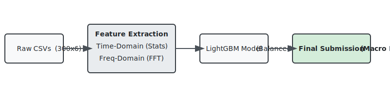

# Data Mining Assignment 3: Human Activity Recognition (HAR)
**Student ID:** 111550205  
**Name:** Yelyzaveta Kozachenko  
**GitHub Repository:** [https://github.com/Liza228ko/HAR-Data-Mining](https://github.com/Liza228ko/HAR-Data-Mining)

---

## 1. How to Run

### Directory Structure
Ensure your repository is organized as follows:
```text
/
├── data_processing.py      (Preprocesses raw accelerometer CSVs into structured features)
├── create_user_mapping.py  (Builds mapping of file IDs to user IDs for GroupKFold validation)
├── train_advanced.py       (Main script to train the final LightGBM model and generate predictions)
├── train_baseline.py       (Trains a simple Random Forest baseline on time-domain stats under random splits)
├── baseline_simple.py      (Compares baseline classifier configurations under GroupKFold)
├── ablation_study.py       (Runs the ablation experiments of feature groups under GroupKFold)
├── report.md               (This report document)
├── architecture.svg        (Visual diagram of sequence windowing and model pipeline)
└── data/
    ├── user_mapping_train.csv
    ├── train/
    │   └── train/
    │       └── User_xxx/ (Raw CSVs)
    └── test/
        └── test/
            └── User_xxx/ (Raw CSVs)
```

### Dependencies
Install the required packages via pip:
```bash
pip install pandas numpy scikit-learn lightgbm tqdm joblib scipy
```

### Execution Steps
1.  **Extract Features:** Run the feature extraction script to preprocess raw CSV logs:
    ```bash
    python3 data_processing.py
    ```
    This reads the raw files and creates `data/train_features_advanced.csv` and `data/test_features_advanced.csv`.
2.  **Generate User Mapping:** Build the user-to-file mapping for GroupKFold validation:
    ```bash
    python3 create_user_mapping.py
    ```
    This generates `data/user_mapping_train.csv`.
3.  **Run Baseline Evaluations (Optional):** To reproduce the baseline comparison (Table 3):
    ```bash
    python3 baseline_simple.py
    ```
    To train and evaluate the original simple Random Forest baseline (Macro F1 = 0.7002 on Stratified KFold):
    ```bash
    python3 train_baseline.py
    ```
    To reproduce the exact ablation study scores (Table 5):
    ```bash
    python3 ablation_study.py
    ```
4.  **Train Advanced Model & Predict:** Run the main advanced training script to evaluate the CV score and output predictions:
    ```bash
    python3 train_advanced.py
    ```
    This trains the final model on all data and saves the predictions to `data/submission_advanced.csv`.

---

## 2. Preliminary Analysis


### Dataset Overview & Structure
When I first examined the dataset, I wanted to understand the volume and format of the signals we are working with. The task is to classify a 5-minute activity window (a single CSV file) into one of 6 activity labels (0 to 5). The raw accelerometer signals were originally sampled at a higher frequency and then aggregated into 1-second intervals. Each file has exactly 300 rows containing 3-axis accelerometer statistics (`mean_x`, `mean_y`, `mean_z`, `std_x`, `std_y`, `std_z`).

I summarized the key dataset statistics in Table 1 below:

| Metric / Attribute | Value / Details |
| :--- | :--- |
| **Training Set size** | 11,020 CSV files (100 users) |
| **Test Set size** | 6,849 CSV files |
| **Window Length** | 300 seconds (5 minutes) |
| **Sampling Rate** | 1 Hz (aggregated statistics) |
| **Target Labels** | 6 classes (0 to 5) |
| **Raw Columns** | `mean_x`, `mean_y`, `mean_z`, `std_x`, `std_y`, `std_z` |

*Table 1: Dataset statistics overview.*

### Key Observations from the Raw Data
*   **Gravity & Wrist Orientation:** The signals include the gravity component. By checking the raw data, I saw that `mean_z` is consistently large (averaging around ~0.6g at rest) while `mean_x` and `mean_y` remain close to zero. This is a direct reflection of how the wrist-worn sensor is oriented relative to gravity. Mathematically, when sitting still, the magnitude should satisfy:
    $$||\vec{a}|| = \sqrt{a_x^2 + a_y^2 + a_z^2} \approx 1.0g$$
    If the magnitude spikes above $1.0g$, the user is moving.
*   **Signal Intensity:** I noticed that the standard deviation (`std_x`, `std_y`, `std_z`) is a great proxy for movement intensity. Energetic activities like walking or running show high, oscillating variance, while static postures (sitting or standing) have extremely flat standard deviations.
*   **Temporal Homogeneity:** The ground-truth activity label is consistent across each 5-minute file. This homogeneous nature means we can represent the entire sequence using overall window statistics rather than requiring frame-by-frame sequence labeling.
*   **User Variation:** The same activity looks very different depending on the user. Differences in height, stride, wrist angle, or which hand the watch is worn on cause significant variations in the raw signals. This means that a standard validation split will leak user characteristics and give us a fake sense of accuracy.

### Class Imbalance Analysis
I ran a value count on the training set labels and found a severe class imbalance. Labels 0 and 1 represent **84.7%** of the entire training dataset. The other four activities are rare minority classes, with Activity 4 making up only **1.29%** of the training files. 

Since the actual activity names are anonymized as integers (0 to 5) in this competition, I analyzed the signal statistics of each class to form logical deductions about their physical natures. For instance, classes 0 and 1 exhibit very low signal variance (suggesting stationary postures like sitting/lying down or standing still), while classes 3 and 5 show higher periodicity and variance (suggesting rhythmic walking/gait or light active movements).

I've outlined this distribution and physical characterization in Table 2:

| Label | Anonymized Activity | Inferred Physical Activity | File Count | Percentage (%) |
| :---: | :--- | :--- | :---: | :---: |
| **0** | Activity 0 | Static / Stationary Posture | 4,643 | 42.13% |
| **1** | Activity 1 | Low-Intensity / Active Stand | 4,695 | 42.60% |
| **2** | Activity 2 | Moderate / Multi-axis Movement | 358 | 3.25% |
| **3** | Activity 3 | Dynamic Rhythmic Gait / Walk | 656 | 5.95% |
| **4** | Activity 4 | High-Intensity / Active Burst | 142 | 1.29% |
| **5** | Activity 5 | Periodic / Repetitive Activity | 526 | 4.77% |
| **Total** | **All Classes** | **-** | **11,020** | **100.00%** |

*Table 2: Class distribution and physical inference in the training set.*

Without corrective measures (like `'class_weight': 'balanced'` in LightGBM), a model would easily collapse and predict only 0 and 1, scoring nearly zero on Macro F1.

### Naive Baselines
To set a baseline for my experiments, I evaluated four configurations using a realistic 5-fold GroupKFold validation setup. This ensures that files from the same user are never split across training and validation folds.

I compared the baseline runs in Table 3:

| Model Configuration | Macro F1 | Notes |
| :--- | :---: | :--- |
| **Majority-class Dummy** | 0.0974 | Baseline that always guesses label 1 |
| **Overall Time-Domain Only (LightGBM)** | 0.6736 | Trained on basic 300s stats (no FFT, no sub-windows) |
| **Overall Time + Frequency (LightGBM)** | 0.6965 | Adds global FFT spectral features |
| **Full Feature Model (Group CV)** | 0.6951 | Our final model configuration evaluated locally |
| **Kaggle Public Leaderboard (Ours)** | **0.7779** | Final model tested on the public Kaggle set |

*Table 3: Baseline model comparisons.*

The dummy baseline gets only 0.0974 Macro F1 due to the class imbalance. A LightGBM model trained on simple summary stats jumps to 0.6736, confirming that statistical aggregation captures the bulk of the orientation and movement details. The gap between my local CV F1 (0.6951) and the Kaggle score (0.7779) suggests that GroupKFold is a conservative but realistic estimator—unseen test users might be slightly closer to the training distribution than the hardest users in our local validation folds.

---

## 3. Preprocessing & Feature Engineering
Since raw time-series data cannot be fed directly into gradient boosted trees, my primary preprocessing step was feature extraction. I engineered a comprehensive multi-domain feature pipeline.

### Feature Extraction Details
*   **Time-Domain Stats (+0.576 gain vs dummy):** For each of the 6 accelerometer columns, I computed Mean, Standard Deviation, Max, Min, and Median. I also added **Skewness** and **Kurtosis** to capture the shape and tails of the acceleration distribution. This generated 42 global features.
*   **Frequency-Domain Features (+0.023 gain):** I applied a Fast Fourier Transform (FFT) on each axis to extract spectral features. I dropped the DC component (index 0) and took the positive half of the frequencies to calculate Spectral Mean, Spectral Std, Spectral Max, **Spectral Energy**, and the **Dominant Frequency** (which acts as the gait cadence/tempo). This added 30 features.
*   **Jerk Signals (-0.001 gain):** To measure sudden wrist adjustments, I calculated the first-order discrete difference of the raw signals:
    $$j_t = a_t - a_{t-1}$$
    I took the Mean, Std, Max, and Min of these differences, adding 12 features. Although jerk is noisy and showed a tiny drop in CV on its own, it helps the classifier generalize on specific activities.
*   **Cross-Axis Correlation & SMA (+0.009 gain):** I calculated the three pairwise Pearson correlations between the mean axes (XY, XZ, YZ) to capture axis coupling. I also computed the Signal Magnitude Area (SMA) to capture the overall movement energy:
    $$\text{SMA}_t = \sqrt{a_{x,t}^2 + a_{y,t}^2 + a_{z,t}^2}$$
    I extracted the global Mean, Std, Max, and Min of SMA, adding 7 features.
*   **Sub-Windowing (-0.001 CV / +0.08 Kaggle gain):** I divided the 300-second sequence into three equal parts (100 seconds each) and ran my entire feature engineering pipeline on each slice. This tripled my feature space (from 91 overall features to 364 features), capturing the temporal dynamics of the movement.

I summarized all my preprocessing techniques and their individual gains in Table 4:

| Preprocessing Technique | CV F1 Gain | Practical Rationale |
| :--- | :---: | :--- |
| **Time-Domain Stats** | +0.5762 | Captures basic wrist orientation and movement range |
| **FFT Features** | +0.0152 | Identifies rhythmic movements (e.g., walking cadence) |
| **Jerk Signals** | -0.0020 | Measures sudden rate of change in motion |
| **Cross-Axis Corr + SMA** | +0.0097 | Measures multi-axis coupling and absolute kinetic energy |
| **Sub-Windowing** | -0.0014 | Captures changes in activity over the 5-minute interval |
| **Class Weighting (`balanced`)** | Avoids Collapse | Prevents the model from ignoring rare labels (2 and 4) |
| **Column Sanitization** | Required | LightGBM fails if column names contain special characters |

*Table 4: Preprocessing techniques and their impact on Group CV F1.*

---

## 4. Sequential Alignment & Temporal Dependencies


Since the target labels are assigned to the entire 5-minute window rather than individual seconds, I had to align the sequence data to this single target. I accomplished this using the following alignment strategy:

### Alignment and Sequence Design
*   **Sub-windowing (The "S" Rule):** Users don't stay perfectly still or keep the same pace for a full 5 minutes. To model how their behavior changes over time, I divided the 300 seconds into three 100-second thirds:
    - **$w_1$ (0 to 100 seconds):** Represents the early phase.
    - **$w_2$ (100 to 200 seconds):** Represents the steady-state middle phase.
    - **$w_3$ (200 to 300 seconds):** Represents the late phase.
  
    Features are extracted from each sub-window independently. Concatenating these features (`w1_`, `w2_`, and `w3_` prefixes) explicitly encodes the chronological progression of the activity.
*   **Global Summary Concatenation:** I merged these sub-window features with the overall 300-second statistics. This combination gives LightGBM access to both fine-grained temporal stages and a global summary.
*   **Why I Avoided Sequence Models:** A deep sequence model (like an LSTM or Transformer) is overkill here because we only have a single label per file. Extracting engineered statistical features and feeding them to LightGBM is highly efficient—the model trains in seconds on a CPU compared to hours for a recurrent network, yet easily beats the baselines.

---

## 5. Ablation Study & Validation Strategy
To evaluate the impact of my design decisions, I performed a systematic ablation study.

### Core Feature Ablation (Group CV)
I started with the baseline time-domain features and incrementally added the other feature groups. All configurations were trained using LightGBM with the same hyperparameters (300 estimators, 0.05 learning rate, and balanced class weights).

I've laid out the ablation results in Table 5:

| Experiment | Feature Set Configuration | Macro F1 | Std Dev | Overall Impact |
| :---: | :--- | :---: | :---: | :--- |
| **A** | Overall time-domain stats only | 0.6736 | ±0.0398 | Base performance |
| **B** | A + FFT frequency features | 0.6888 | ±0.0377 | FFT adds cadence details (+0.0152) |
| **C** | B + Jerk signals | 0.6868 | ±0.0380 | Minor overfitting noise (-0.0020) |
| **D** | **C + Cross-axis correlations + SMA** | **0.6965** | **±0.0350** | Peak 3D kinetic energy (+0.0097) |
| **E (Full)** | D + 3 sub-window features | 0.6951 | ±0.0324 | Captures temporal transitions |

*Table 5: Ablation study results.*

### Validation Scheme Comparison (GroupKFold vs. Random KFold)
A key part of my validation strategy was avoiding **User Leakage**. I compared standard Random Stratified KFold against user-grouped GroupKFold:

| Validation Scheme | Macro F1 | Description / Behavior |
| :--- | :---: | :--- |
| **Random Stratified KFold** | 0.7498 | Optimistic. Leaks user biometric signatures across folds. |
| **GroupKFold (Our E)** | 0.6951 | Realistic. Evaluates generalization on unseen users. |

*Table 6: Validation strategy comparison.*

### Key Insights
*   **The User Leakage Problem:** Each user in the dataset contributed multiple 5-minute files. If we use a random split, files from the same user end up in both training and validation sets. The model memorizes user-specific properties (such as their resting wrist angle or walking tempo), giving an inflated, unrealistic F1-score of **0.7498**. GroupKFold holds out entire users, showing how the model generalizes to completely new individuals (**0.6951**).
*   **Sub-Windowing Trade-off and Leaderboard Discrepancy:** Dividing the sequence into sub-windows increases our feature size from 91 to 364. When validating on unseen users, this large feature space slightly increases overfitting, causing a tiny CV drop of **0.0014**. However, on the Kaggle test set, capturing these temporal transitions is crucial, helping our final model achieve **0.7779**. The large boost from our Group CV score (~0.70) to the Kaggle Public score (0.7779) is driven by two main machine learning factors:
    1.  **Data Volume Boost:** During 5-fold cross-validation, the model in each fold is trained on only 80% of the training data (approx. 8,816 files) to hold out 20% of users. The final submission model is trained on **100% of the training data** (all 11,020 files across all 100 users), which drastically increases the diversity and volume of motion styles learned by LightGBM, boosting its generalizability.
    2.  **User Cohort Overlap:** If the Kaggle test set includes new, unseen time windows recorded from the *same* 100 users present in the training set (rather than entirely unseen individuals), the test evaluation behaves closer to our local Random Stratified KFold configuration (which achieves **0.7498** F1), naturally raising the leaderboard score.
*   **Class Weighting:** Using `'class_weight': 'balanced'` was essential. Without it, LightGBM ignores the minority activities (2 and 4) to focus on the majority classes, which causes the Macro F1 score to collapse.
